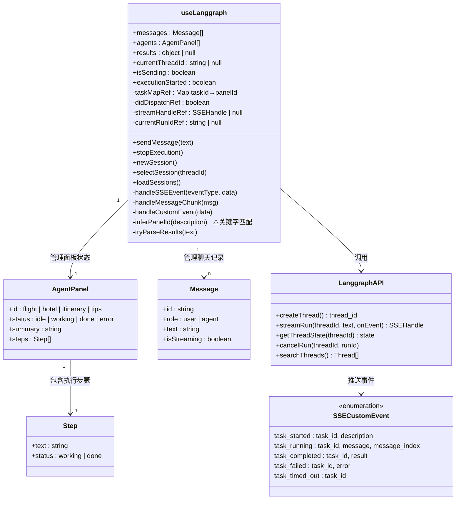
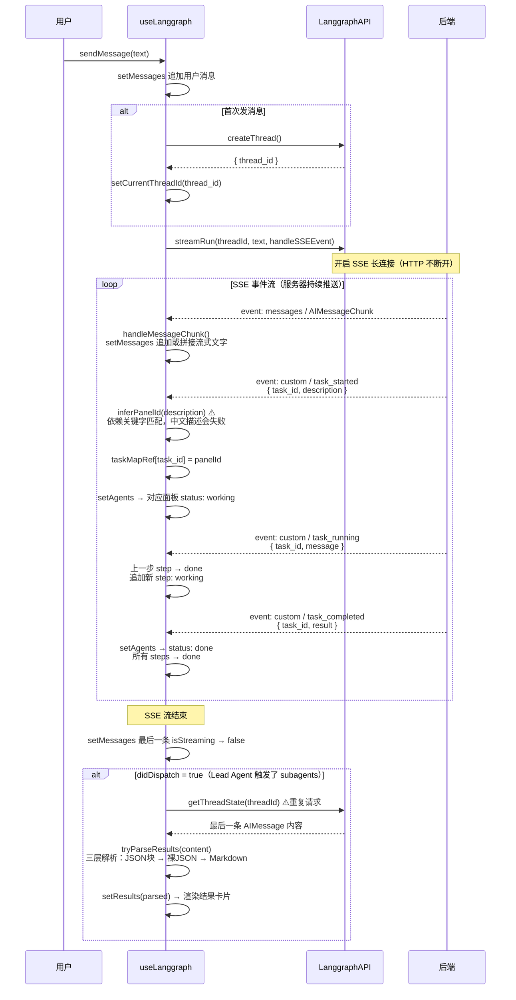
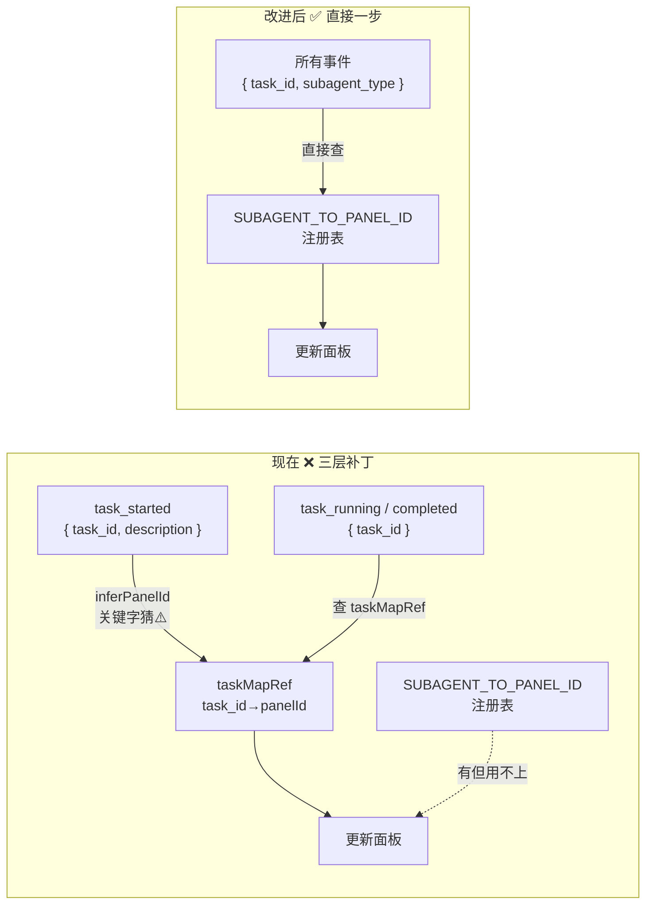

# Nomie Agent 数据流转图

> 本文档记录 Nomie 从用户发送消息到最终渲染结果卡片的完整数据流转。
> 分两类图：**结构图**（每个模块有什么）+ **时序图**（它们怎么交互）。

---

## 站①② 前端层（Frontend）

### useLanggraph 是什么

`useLanggraph.js` 是前端的**唯一数据入口**，本质是一个状态管理器 + 通信适配器，做三件事：

**① 管理所有前端状态**
界面上能看到的所有数据都住在这里——聊天记录（`messages`）、四个 agent 面板的状态（`agents`）、结果卡片数据（`results`）、当前会话 ID（`currentThreadId`）。React 组件只是把这些状态"画"出来，数据本身全在 `useLanggraph`。

**② 决定什么数据推到前端、怎么更新**
后端通过 SSE 持续推送两类消息：Lead Agent 的聊天文字（`messages` 事件）和 subagent 的进度（`custom` 事件）。`useLanggraph` 里的 `handleSSEEvent` 是总路由，收到不同类型的事件就分发给不同的处理函数，决定更新哪块状态。subagent 本身在后端运行，前端完全看不到它的内部——能看到的只是 `task_tool` 选择性推出来的进度事件。

**③ 封装所有网络请求**
创建会话（`createThread`）、开启 SSE 流（`streamRun`）、拉取最终状态（`getThreadState`）、取消任务（`cancelRun`）全都封装在这里，React 组件不直接发任何请求。

```
React 组件
    ↓ 调用
useLanggraph（状态 + 逻辑）
    ↓ 调用
LanggraphAPI（网络请求）
    ↓ SSE / HTTP
后端 Lead Agent + task_tool
```

---

### 结构图：useLanggraph Hook

**useLanggraph**
整个前端的"大脑"，是一个 React Hook（可以理解为一个状态管理器）。它持有所有界面数据（聊天记录、agent 面板状态、搜索结果），同时封装了所有操作（发消息、停止、新会话）。外部组件只需要调用它暴露的方法，不需要知道内部细节。

**AgentPanel**
代表界面上四个 agent 卡片（航班/酒店/行程/小贴士）之一。每张卡片有自己的状态（空闲/工作中/完成/错误）和一个步骤列表，用于实时显示 agent 正在做什么（比如"正在搜索 Google Flights..."）。

**Step**
AgentPanel 里的单条执行记录。每当后端推来一条 `task_running` 事件，就追加一个新 Step。上一个 Step 自动标记为完成，形成进度流水线的视觉效果。

**Message**
聊天气泡的数据模型。`isStreaming: true` 表示这条消息还在流式输出中（文字还在增长），`false` 表示已完成。

**LanggraphAPI**
封装了所有网络请求的模块。`createThread` 创建会话，`streamRun` 开启 SSE 连接，`getThreadState` 在 SSE 结束后补拉一次完整状态，`cancelRun` 用于中止正在运行的任务。

**SSECustomEvent**
后端通过 SSE 推来的自定义事件类型枚举。`task_started` 表示某个 subagent 开始运行，`task_running` 表示它产生了新的中间步骤，`task_completed` 表示它完成并返回结果，`task_failed/timed_out` 表示失败。



---

### 时序图：用户发消息 → SSE 事件处理

**Step 1 — 发消息 & 建立会话**
用户点击发送后，`sendMessage` 先把用户消息追加到聊天列表（让界面立刻有反馈），然后检查是否已有 `thread_id`。如果是第一条消息，就向后端创建一个新会话（Thread），拿到 `thread_id` 存起来。后续所有消息都复用这个 ID，这样后端的 Lead Agent 才能记住上下文。

**Step 2 — 开启 SSE 连接**
调用 `streamRun(threadId, text, handleSSEEvent)`。这不是普通的"发请求等回复"，而是建立一条持久连接。后端只要产生任何数据（AI 文字、agent 进度），就立刻推过来，不需要前端再问。`handleSSEEvent` 是注册的回调函数，每收到一条事件就自动触发。

**Step 3 — 处理 AI 文字流（messages 事件）**
后端 Lead Agent 的每一段文字输出都会以 `AIMessageChunk` 形式推来。`handleMessageChunk` 把它追加到最后一条消息的文字里，形成"打字机"效果。含有 tool_calls 的消息（Lead Agent 调用 task 工具时）会被过滤掉，不显示在聊天框里。

**Step 4 — 处理 task_started 事件**
当 Lead Agent 调用 `task()` 工具启动一个 subagent 时，后端会推来 `task_started` 事件，携带 `task_id`（随机字符串）和 `description`（如 "Search flights"）。前端用 `inferPanelId` 从 description 关键字猜出对应面板，把映射存入 `taskMapRef`，并把该面板状态更新为 working。⚠️ 这里是脆弱点：如果 description 是中文，关键字匹配会失败。

**Step 5 — 处理 task_running 事件**
subagent 每产生一条 AI 消息（比如调用了 web_search 工具），后端就推一条 `task_running` 事件。前端把上一条 Step 标为完成，追加新的 Step 显示当前动作。这就是界面上 agent 卡片里进度条逐步推进的来源。

**Step 6 — 处理 task_completed 事件**
subagent 完成后推来 `task_completed`，对应面板状态变为 done，所有 steps 标为完成。

**Step 7 — SSE 结束，拉取最终结果**
SSE 流关闭后，如果检测到有 subagent 被触发过（`didDispatch = true`），前端会额外调用一次 `getThreadState` 拉取完整的最后一条 AI 消息。⚠️ 这是一次重复请求——理论上 SSE 流里已经有这条消息了，但由于流式 chunk 处理时会过滤掉部分消息，所以用这个方式兜底。拿到内容后用 `tryParseResults` 三层解析（JSON 代码块 → 裸 JSON → Markdown 结构），成功则渲染结果卡片。



---

## 已知设计问题与改进方案

### 问题 #1：`subagent_type` 在 SSE 事件中丢失

**根本原因**

`task_tool.py` 第110行把 `subagent_type` 写进了日志，但第114行推给前端的 `task_started` 事件没有带上它：

```python
# 有意识地记了日志
logger.info(f"... subagent={subagent_type} ...")

# 但 SSE 事件漏掉了
writer({"type": "task_started", "task_id": task_id, "description": description})
#                                                    ↑ subagent_type 没有传
```

**连锁影响**

这一个遗漏导致前端产生了三层补丁：
1. `inferPanelId(description)` —— 靠关键字猜 panelId，中文描述会失败
2. `taskMapRef` —— 存储 `task_id → panelId` 的临时映射表
3. `SUBAGENT_TO_PANEL_ID` 注册表 —— 已经写好，但因为收不到 `subagent_type` 而完全用不上



**改进方案**

后端：所有 SSE 事件统一加 `subagent_type` 字段（`task_tool.py`）

```python
# 修改前
writer({"type": "task_started",   "task_id": task_id, "description": description})
writer({"type": "task_running",   "task_id": task_id, "message": message})
writer({"type": "task_completed", "task_id": task_id, "result": result.result})

# 修改后
writer({"type": "task_started",   "task_id": task_id, "description": description, "subagent_type": subagent_type})
writer({"type": "task_running",   "task_id": task_id, "message": message,         "subagent_type": subagent_type})
writer({"type": "task_completed", "task_id": task_id, "result": result.result,    "subagent_type": subagent_type})
```

前端：`handleCustomEvent` 中直接查注册表，删除 `inferPanelId` 和 `taskMapRef`（`useLanggraph.js`）

```js
// 修改前
const panelId = inferPanelId(data.description)      // 关键字猜
taskMapRef.current[taskId] = panelId                 // 存临时映射

// 修改后
const panelId = SUBAGENT_TO_PANEL_ID[data.subagent_type]  // 直接查注册表
// taskMapRef 完全不需要了
```

---

### 问题 #2：subagent 结果在 `task_completed` 事件中被丢弃

**现象**：每个 subagent 完成时，`task_completed` 事件已经携带了完整的结果数据（航班/酒店/行程/贴士），但前端处理时完全忽略了 `data.result`，只更新了 panel 状态为"完成"。用户必须等所有 4 个 subagent 都跑完、Lead Agent 汇总完毕后才能看到任何卡片内容。

**代码证据**

后端已经把数据发出来了：
```python
# task_tool.py
writer({"type": "task_completed", "task_id": task_id, "result": result.result})
#                                                       ↑ 完整的航班/酒店数据在这里
```

前端把它扔了：
```js
// useLanggraph.js
} else if (data.type === 'task_completed') {
  setAgents(...status: 'done'...)
  // data.result 完全没有被使用
}
```

**渲染时机对比**

```
现在（慢）：
flight 完成 → panel 绿勾，卡片数据被扔掉
hotel 完成  → panel 绿勾，卡片数据被扔掉
itinerary 完成 → panel 绿勾，卡片数据被扔掉
tips 完成   → panel 绿勾，卡片数据被扔掉
Lead Agent 汇总 → getThreadState → 四张卡同时出现（用户等到这里）

改进后（快）：
flight 完成 → 立刻渲染航班卡 ✅
hotel 完成  → 立刻渲染酒店卡 ✅
itinerary 完成 → 立刻渲染行程卡 ✅
tips 完成   → 立刻渲染贴士卡 ✅
Lead Agent 不再需要汇总 JSON，getThreadState 可以删除
```

**改进方案**：`handleCustomEvent` 处理 `task_completed` 时，用 `SUBAGENT_TO_PANEL_ID` 查到对应卡片类型，直接解析 `data.result` 更新对应的 results 字段，无需等待 Lead Agent 汇总。

---

### 问题 #3：Lead Agent 不应该承担汇总 JSON 的职责（与问题 #2 关联）

**现象**：Lead Agent 被 prompt 强制要求在所有 subagent 完成后输出一段纯 JSON，这段 JSON 会渲染成聊天气泡暴露给用户，且 Lead Agent 必须等 4 个 subagent 全部完成才能开始汇总。

**根本原因**：结果卡片的渲染责任被设计给了 Lead Agent，而不是各个 subagent 自己。这导致：
1. Lead Agent 的 prompt 里有大量 JSON schema 约束，变得复杂且脆弱
2. 用户必须等所有任务都结束，才能看到第一张卡片
3. Lead Agent 的最终输出是结构化数据而非自然语言，混入聊天气泡不合适

**与问题 #2 的关系**：如果问题 #2 修复（每个 subagent 的 `task_completed` 直接更新对应卡片），则 Lead Agent 完全不需要再输出 JSON，问题 #3 自然消失。Lead Agent 可以回归"对话协调者"的角色，用自然语言告诉用户搜索完成即可。

---

## 站③④⑤ 后端层（待补充）

<!-- TODO: task_tool → SubagentExecutor → Lead Agent prompt -->
